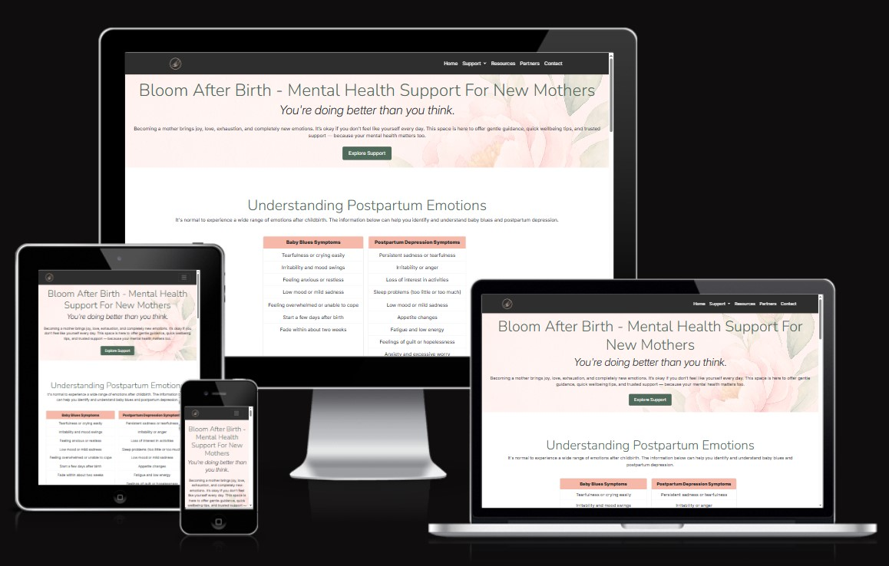

# Bloom After Birth - Mental Health Support for New Mothers

**Live site:** https://leilacsak.github.io/bloom-after-birth/

This project is a one-page, responsive website designed to support new mothers who may be experiencing emotional, mental, or physical challenges during the postpartum period. The site provides gentle guidance, quick wellbeing tips, and trusted support resources. This project includes a dedicated "Partners" section that highlights simple, practical ways others can support new mothers. The goal is to create a supportive digital space that is easy to navigate, mobile-friendly, and sensitive to the needs of new mothers.

## Features

### Hero section
Welcoming, supportive introduction of the sites purpose and its main message.

### Emotions 
Information cards explaining baby blues and postpartum depression.

### Tips
Quick Wellbeing Tips for New Mothers. 

 ### Affirmations
 Positive message images play in an automatically changing carousel for emotional reassurance. 

 

### Partners
Showcases support tips for partners and family members in a form of list with icons.

### Resources
Trusted resource informations and buttons that are links to sites: NHS, PANDAS, Mind, Samaritans.

### Navigation bar

The navbar is a fully responsive, fixed top navigation that lets users jump between sections such as: Home, Support, Resources, Partners, Contact. Under the Support tab, users will find a dropdown menu with additional helpful options: Emotions, Tips, Affirmations. The contact menu item links to the Contact informations placed in the footer. This keeps the navbar clean and organised. It includes a smooth hover highlight, making it easy for users to see which page they’re about to select. When hovering over any menu item, the text changes colour. 

On tablets and mobile devices, the navigation bar automatically adapts to smaller screens: instead of displaying the full navigation links, it switches to a burger icon.

### Footer 

The footer includes Contact information. There is a "Message Us" button which links to a modal where users can submit a message. There are social networks icons as well and a dislclaimer.

Modal window:

 

## UX

### User Stories

**User 1:**
 As a new mother, I want the site to be easy to navigate, so I can find information and support I need without feeling overwhelmed.
**Acceptance Criteria:**
- Responsive navbar is implemented and adapts seamlessly to different screen sizes
- Anchor links correctly direct users to the relevant sections of the page
- Navigation bar collapses on mobile
**Tasks:**
- Build a responsive Bootstrap navbar
- Add and configure anchor links for key sections
- Test scrolling and link functionality on desktop and mobile

**User 2:**
As a visitor, I want to easily find clear contact information, so I can reach out for additional support or request further resources when I need help.
**Acceptance Criteria:**
- Footer displays a visible contact option (email address)
- Contact information is concise, accessible, and easy to understand.
- Works seamlessly on both desktop and mobile layouts
- Text and links meet accessibility standards (contrast, font size, tap targets)
- Include a disclaimer
**Tasks:**
- Write and insert contact details into the footer
- Style the footer for readability and responsiveness
- Test functionality
- Verify accessibility compliance
- Add disclaimer message

**User 3:**
As a new mother, I want a clear and supportive introduction, so I immediately feel understood and reassured when I arrive on the site.
**Acceptance Criteria:**
- Hero section includes calming headline, supportive subtext, and CTA button.
- Text is readable and accessible and maintains appropriate contrast for all devices
- Layout adapts responsively across desktop and mobile
**Tasks:**
- Create hero section
- Add heading & subtext & CTA button content
- Style hero section CSS/Bootstrap for readability and visual appeal
- Test readability (contrast, font size, screen reader compatibility)
- Validate responsiveness on multiple devices

**User 4:**
As a new mother, I want to understand baby blues vs postpartum depression, so I know when to seek help.
**Acceptance Criteria:**
- An Info card explains both conditions simply and in a supportive language
- Content is presented in short for easy reading
- Layout is styled for readability across desktop and mobile devices
**Task:**
- Write content for the PPD vs baby blues card
- Add content: differences and signs to watch for
- Style card with CSS/Bootstrap for clarity and responsiveness.
- Test readability and accessibility on multiple devices.

**User 5:**
As a new mother, I want quick and practical wellbeing tips, so I can care for myself even with limited time.
**Acceptance Criteria:**
- Cards contain short, actionable self‑care tips
- Readable and visually supportive layout
- Cards are fully responsive
- Content is accessible with appropriate contrast and font size
**Task:**
- Create 3-4 wellbeing tip cards with concise content
- Implement layout: Use Bootstrap grid system
- Style cards for clarity and calming design
- Test responsiveness and usability on mobile devices

**User 6:**
As a new mother, I want quick access to trustworthy support resources, so I know where to get help when I need it.
**Acceptance Criteria:**
- Resources section includes NHS, PANDAS, Mind, Samaritans links
- Links are styled as large, easy‑to‑tap buttons for mobile users
- Buttons open in new tabs (target="_blank") to avoid losing the main site
- Layout is responsive and accessible across devices
**Tasks:**
- Add a dedicated resources section to the site
- Insert and configure external links to NHS, PANDAS, Mind UK, and Samaritans
- Style buttons with CSS/Bootstrap for clarity and usability
- Ensure links open in new tabs -> (target="_blank")
- Test responsiveness and accessibility (tap targets, contrast, font size)

**User 7:**
As a new mother, I want uplifting affirmations, so I feel encouraged and supported on difficult days.
**Acceptance Criteria:**
- Slideshow displays 4–6 affirmations, rotating automatically with smooth transitions
- Users can manually navigate affirmations
- Design uses calming colors to create a supportive atmosphere
- Slideshow is responsive and mobile‑friendly
**Tasks:**
- Add affirmations section with slideshow functionality (Bootstrap Carousel)
- Insert 4–6 affirmation statement photos.
- Generate the photos with AI
- Configure autoplay with gentle transition effects
- Add navigation controls
- Test responsiveness and accessibility (contrast, font size, tap targets)

**User 8:**
As a partner, I want clear guidance on how to support a new mother, so I can offer the right help and feel confident in providing meaningful support.
**Acceptance Criteria:**
- A dedicated partner support section is included on the site
- Section contains simple, practical tips with icons
- Content is concise, empathetic, and easy to understand
- Layout is styled lightly for readability and accessibility across devices
**Tasks:**
- Add a partner support section to the site
- Write 5–10 practical tips for partners
- Add fa icons
- Test readability and accessibility on desktop and mobile

### Strategy

- Supporting new mothers with gentle, accessible mental health resources and information
- Providing affirmations and wellbeing tips to reduce feelings of stress, depression and isolation
- Advising partners on how to support new mothers
- Building trust through clear design and credible links

### Scope

- Included: Responsive layout, informations of sickness symptoms, affirmations carousel, wellbeing tips cards, support ideas for partners, resource links, contact form and social netwrok links
- Excluded (future scope): audio affirmations

### Wireframes 

Wireframes were created with Balsamiq.

**Desktop view:**

**Mobile view:**

## Design

- Typography: Inter and Nunito
- Color palette:
  
- Images were created by AI

## Technologies Used

- Languages: HTML5, CSS3, JS
- Frameworks & Libraries: Bootstrap 5, Font Awesome
- Programs & Tools: GitHub, Prettier, Chrome DevTools, W3C Validators → HTML/CSS validation, Tinify, Microsoft Copilot, VS Code, Miro board and Balsamiq

## Deployment
This project is deployed using GitHub Pages.
**How to Deploy:**
- Push your project folder to a GitHub repository.
- Go to Settings → Pages.
- Under Source, select main branch and /root folder.
- Save the settings.
- Your site will be live at: https://yourusername.github.io/your-repo-name

## Future Features: 

Audio Affirmations Gentle voice recordings of affirmations for users who prefer listening over reading.

**User Story:**
**User:**
As a new mother, I want access to calming audio or guided relaxation tracks, so I can quickly reduce stress during overwhelming moments.
**Acceptance Criteria:**
- Audio player embedded in the site (play/pause, volume control)
- 2–3 short guided breathing or mindfulness tracks (max 5 minutes)
- Works on mobile devices with simple controls
- Clear alt text and captions for accessibility
**Tasks:**
- Source or create short relaxation audio files
- Embed audio player in a new section (“Relaxation Corner”)
- Style player with simple, large buttons for easy use
- Test playback on desktop and mobile

## Validation and Testing 
**To ensure code quality and meet assignment requirements:**
- HTML validated using W3C HTML Validator
  

- CSS validated using W3C Jigsaw CSS Validator
  

- Lighthouse Test

  
  
- All images include descriptive alt text
- Colour contrast checked for accessibility

  **Bugs:**

  - Carousel alignment issues: Affirmations carousel wasn’t visually centered, especially on tablet view. Fix: Wrapped carousel in mx-auto and used col-md-10 col-lg-8 with justify-content-center.
  - Carousel on mobile view touching edges / styling issues. Fix: Wrapped carousel in container (mx-auto px-3 px-md-0) and used BootStrap utilities and later adjusted CSS.
  - Navbar scroll overlap: Fixed navbar overlapped content when anchor links were clicked. Fix: Added custom JS that calculates navbar.offsetHeight and applies smooth scroll offset. Also used scroll-padding-top       in CSS for consistent spacing.
  - Footer social icons: Icons unevenly spaced and modal button styling clashed with footer layout. Fix: Used list-inline-item me-3 for consistent spacing, unified button styles with Bootstrap utilities, and          improved disclaimer readability with larger font size and better contrast.
  - Logo not showing on deployed site (wrong file path / case-sensitivity). Fix: Corrected the file path.
  - “Message Us” button in footer had no working modal / contact form broken. Fix: Added modal HTML + necessary JavaScript to make “Message Us” button open a contact form modal.
  - Cards in “Emotions” section had uneven height and mis-alignment.Fix: Added .h-100 and .d-flex justify-content-center wrappers on card columns.
  - HTML / CSS validation: Cleaned up HTML markup & CSS, removed redundant or invalid code, corrected missing element end tags.
    
  

## Credits

- AI tool such as Copilot were used strategically throughout the development in VScode.
- I have used ChatGPT to give me ideas for website content and user stories.
- Images were created with Canva https://www.canva.com/templates
- Images were resized by Tinify  https://tinypng.com/
- Icons are from https://fontawesome.com/
- Fonts are from https://fonts.google.com/
- My color palette link: https://coolors.co/f6b8a8-faf9f7-dde7e2-4f6a5a-2e2e2e
- External resources credited: NHS, PANDAS Foundation, Mind UK, Samaritans
- Content written for educational use and mental wellbeing guidance.
- Bootstrap Framework: https://getbootstrap.com
  

  
  
  

 

 

